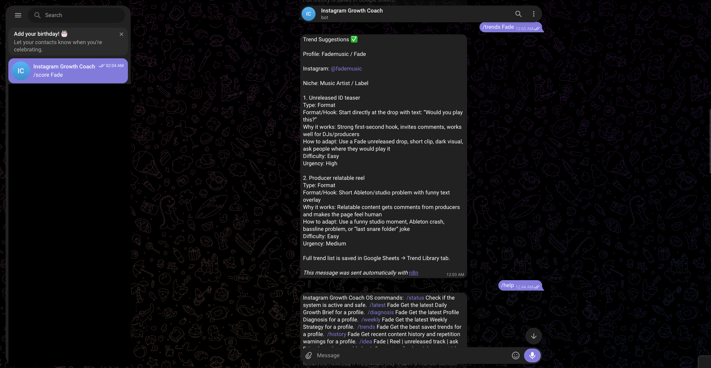
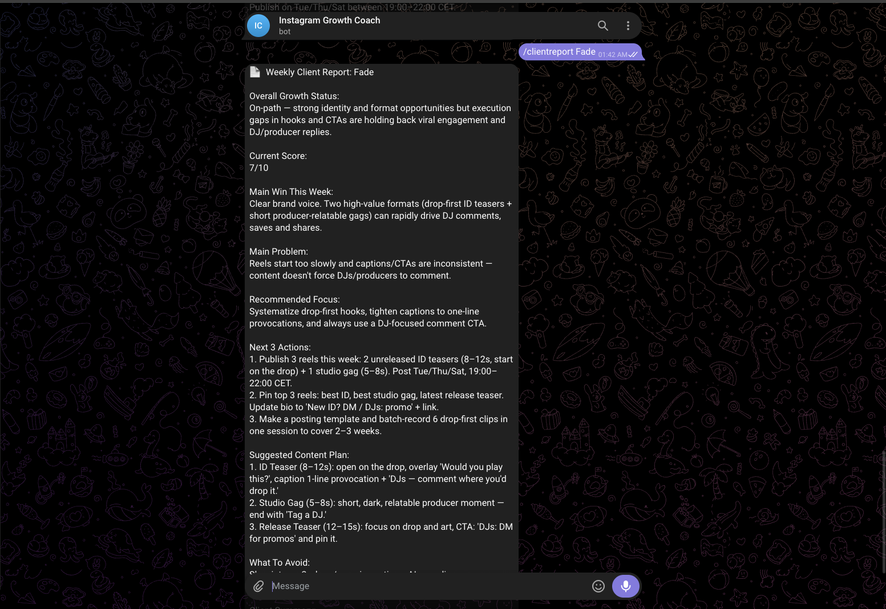
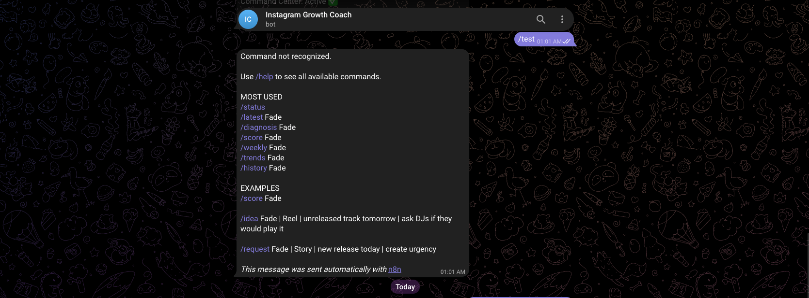
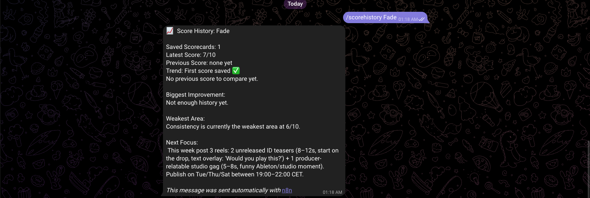

# AI Instagram Growth Coach OS

AI-powered Instagram growth and content strategy automation system built with n8n, OpenAI, Telegram, and Google Sheets.

---

## Overview

The AI Instagram Growth Coach OS is designed to help creators, artists, brands, and businesses grow their Instagram presence using intelligent workflow automation and AI-powered strategic analysis.

The system studies Instagram profiles, analyzes recent content performance, researches viral trends and competitors, and automatically generates strategic content recommendations, growth insights, hooks, captions, posting strategies, scorecards, weekly client reports, and Telegram-delivered growth briefs.

The project started as a daily Instagram growth brief generator and has evolved into a more advanced Growth Intelligence OS with profile diagnosis, trend research, score history tracking, client reporting, and an interactive Telegram Command Center.

---

# System Preview

## Main Workflow Architecture


---

## Daily Growth Brief System


---

## Strategy & AI Recommendation Engine


---

## Delivery & Status System


---

## Telegram Command Center

### AI Telegram Command Center & Help Menu


---

## AI Trend Research System

### Telegram Trend Suggestions & Command Center



---

## Weekly Client Report

The system can generate a weekly client-style growth report directly inside Telegram, including growth status, score, key wins, main problems, recommended focus, next actions, suggested content plan, and what to avoid.



---

## Score History Tracking

The Telegram Command Center can also return profile score history, latest score, previous score, trend status, weakest area, and next strategic focus.



---

## Unknown Command Handling

The system includes fallback handling for unrecognized Telegram commands and guides the user back to the correct available commands.



---

# Core Features

* AI-generated daily growth briefs
* Viral trend analysis
* Competitor research engine
* Profile diagnosis and scoring
* Profile scorecard generation
* Score history tracking
* Weekly client report generation
* Hook and caption generation
* Brand voice intelligence system
* Weekly content strategy generation
* Telegram command center integration
* Telegram help menu
* Unknown command fallback handling
* AI trend suggestion system
* Quick content idea request system
* Content request logging
* Duplicate content protection
* Content history tracking
* Smart posting recommendations
* Multi-niche support architecture
* AI-powered content planning
* Google Sheets database structure
* Human-readable Telegram delivery

---

# Telegram Command Center

The Telegram Command Center allows users to request growth intelligence on demand instead of waiting only for automatic daily reports.

Supported command examples include:

```text
/status
/help
/latest Fade
/diagnosis Fade
/score Fade
/scorehistory Fade
/weekly Fade
/trends Fade
/history Fade
/clientreport Fade
/idea Fade | Reel | unreleased track tomorrow | ask DJs if they would play it
/request Fade | Story | new release today | create urgency
```

The system can return profile analysis, content ideas, latest growth briefs, trend suggestions, scorecards, score history, weekly strategy, and client-ready reports.

---

# Tech Stack

* n8n
* OpenAI API
* Telegram Bot API
* Google Sheets API
* Workflow Automation
* AI Prompt Engineering
* JSON Logic
* Webhooks

---

# Workflow Architecture

Instagram Profiles
→ Content Analysis
→ Trend Research
→ Competitor Intelligence
→ Brand Voice Matching
→ Content History Check
→ AI Strategy Engine
→ Growth Brief Generation
→ Scorecard Generation
→ Weekly Client Report
→ Telegram Delivery
→ Google Sheets Storage

---

# Google Sheets System

The system uses Google Sheets as a lightweight database for the MVP.

Main sheets include:

* Instagram Profiles
* Instagram Posts
* Trend Library
* Viral Profiles
* Daily Growth Briefs
* Weekly Strategy
* Brand Voice Library
* Content Requests
* Content History
* Profile Diagnosis
* Scorecards
* Run Log
* Control Panel

---

# Supported Niches

* Music Artists
* DJs & Record Labels
* Tattoo Artists
* Coaches
* Restaurants
* Fitness Brands
* Personal Brands
* Content Creators
* Small Businesses

---

# Future Vision

The long-term vision is to evolve this project into a complete AI-powered Growth Intelligence OS that helps creators and businesses make smarter content decisions automatically.

Future roadmap ideas include:

* Instagram API integrations
* WhatsApp delivery system
* AI engagement scoring
* Content performance prediction
* Multi-platform strategy generation
* SaaS dashboard platform
* AI onboarding assistant
* Automated reporting systems
* Client management system
* AI trend prediction engine

---

# Built By

Fadi Aziz
AI Automation Builder & Workflow Systems Designer
