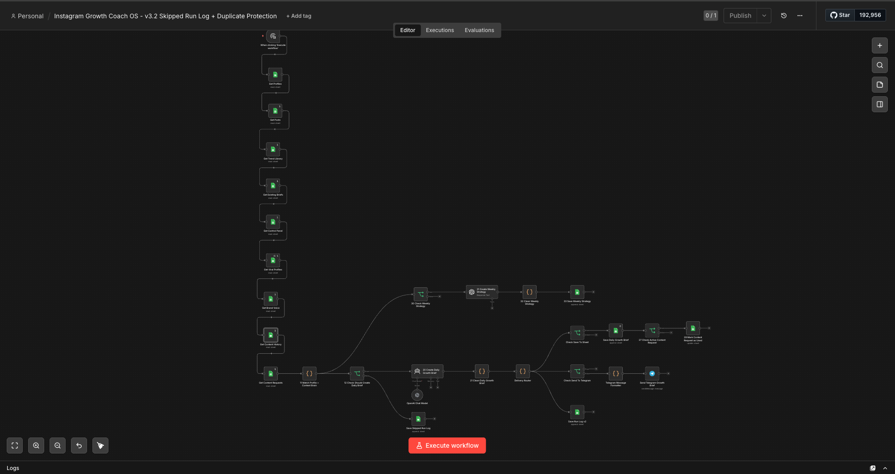
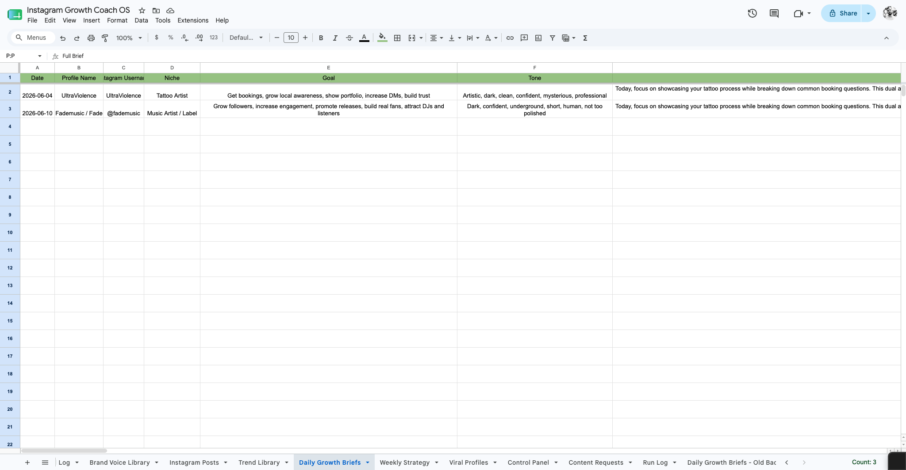
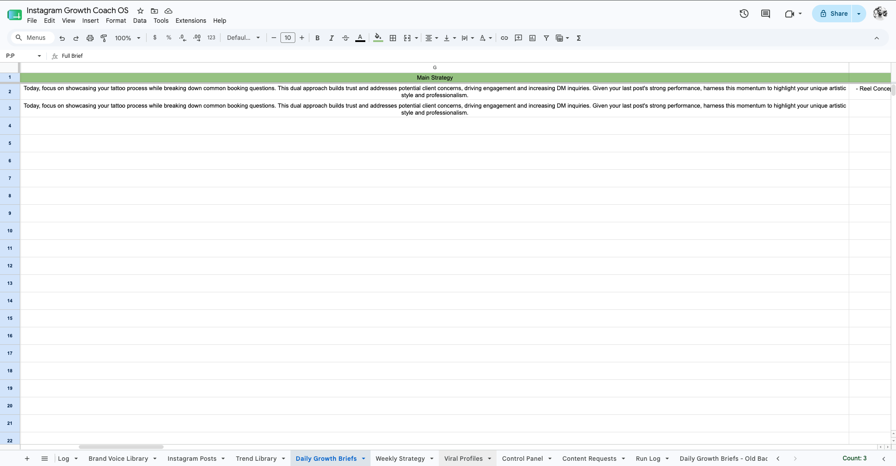
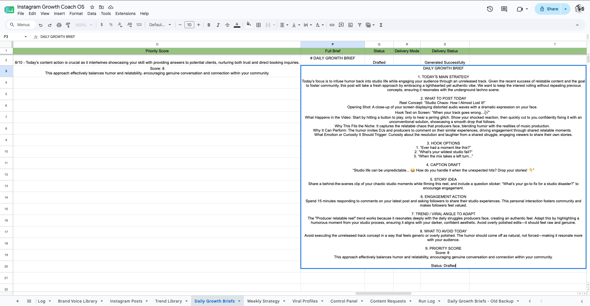
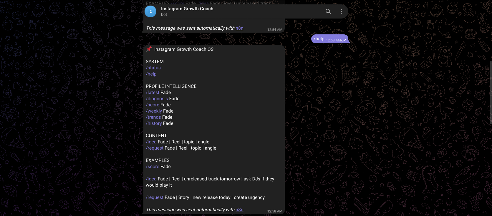

# AI Instagram Growth Coach OS

AI-powered Instagram growth and content strategy automation system built with n8n, OpenAI, Telegram, and Google Sheets.

---

## Overview

The AI Instagram Growth Coach OS is designed to help creators, artists, brands, and businesses grow their Instagram presence using intelligent workflow automation and AI-powered strategic analysis.

The system studies Instagram profiles, analyzes recent content performance, researches viral trends and competitors, and automatically generates strategic content recommendations, growth insights, hooks, captions, posting strategies, and Telegram-delivered growth briefs.

---

# System Preview

## Main Workflow Architecture

---

## Daily Growth Brief System

---

## Strategy & AI Recommendation Engine

---

## Delivery & Status System

---

## Telegram Command Center

### AI Telegram Content Request Example

---

# Core Features

* AI-generated daily growth briefs
* Viral trend analysis
* Competitor research engine
* Profile diagnosis and scoring
* Hook and caption generation
* Brand voice intelligence system
* Weekly content strategy generation
* Telegram command center integration
* Duplicate content protection
* Content history tracking
* Smart posting recommendations
* Multi-niche support architecture
* AI-powered content planning

---

# Tech Stack

* n8n
* OpenAI API
* Telegram Bot API
* Google Sheets API
* Workflow Automation
* AI Prompt Engineering
* JSON Logic
* Webhooks

---

# Workflow Architecture

Instagram Profiles
→ Content Analysis
→ Trend Research
→ Competitor Intelligence
→ AI Strategy Engine
→ Growth Brief Generation
→ Telegram Delivery
→ Google Sheets Storage

---

# Supported Niches

* Music Artists
* DJs & Record Labels
* Tattoo Artists
* Coaches
* Restaurants
* Fitness Brands
* Personal Brands
* Content Creators
* Small Businesses

---

# Future Vision

The long-term vision is to evolve this project into a complete AI-powered Growth Intelligence OS that helps creators and businesses make smarter content decisions automatically.

Future roadmap ideas include:

* Instagram API integrations
* WhatsApp delivery system
* AI engagement scoring
* Content performance prediction
* Multi-platform strategy generation
* SaaS dashboard platform
* AI onboarding assistant
* Automated reporting systems
* Client management system
* AI trend prediction engine

---

# Built By

Fadi Aziz
AI Automation Builder & Workflow Systems Designer
